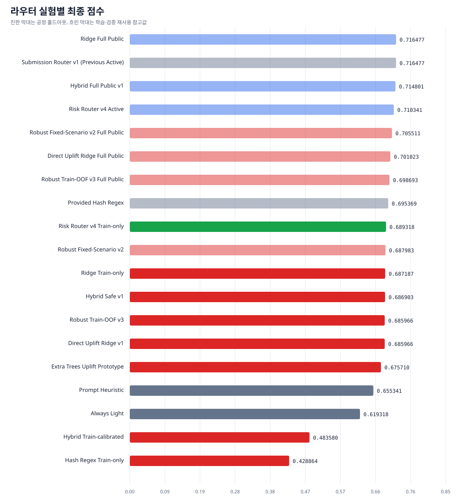
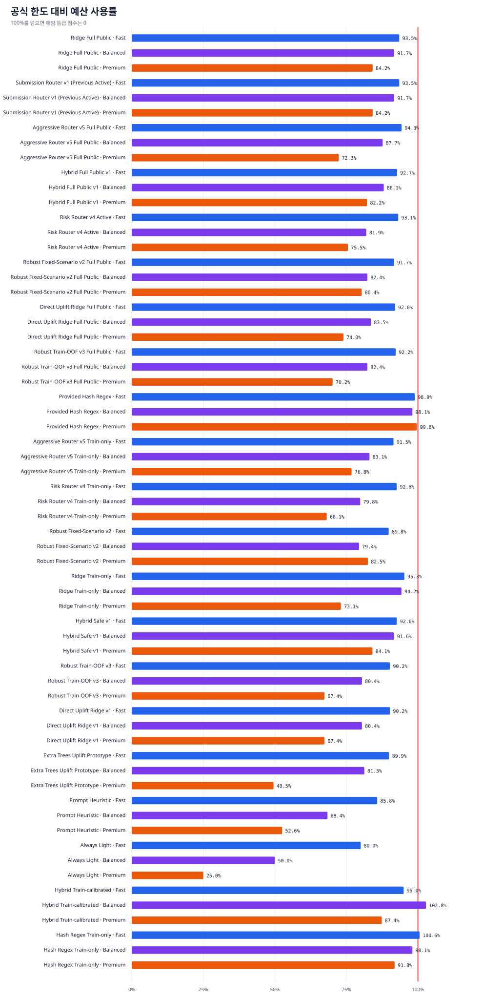

<!--
SPDX-FileCopyrightText: Copyright 2026 SK TELECOM CO., LTD.
SPDX-License-Identifier: Apache-2.0
-->

# 라우터 실험 비교

이 문서는 `experiments/registry.json`에서 자동 생성됩니다. 공정한 홀드아웃과
학습·검증에 재사용한 참고 점수를 구분해 해석해야 합니다.

## 요약

| 실험 | 상태 | 공정 홀드아웃 | 최종 점수 | Fast 비용 | Balanced 비용 | Premium 비용 |
| --- | --- | --- | ---: | ---: | ---: | ---: |
| Aggressive Router v5 Full Public | candidate | 아니오 | 0.714915 | 1.178468 | 1.753652 | 2.893612 |
| Aggressive Router v5 Train-only | champion | 예 | 0.695170 | 1.143321 | 1.661573 | 3.072558 |
| Always Light | reference | 예 | 0.619318 | 1.000000 | 1.000000 | 1.000000 |
| Extra Trees Uplift Prototype | rejected | 예 | 0.675710 | 1.123850 | 1.625282 | 1.981720 |
| Provided Hash Regex | reference | 아니오 | 0.695369 | 1.235989 | 1.961506 | 3.985205 |
| Hash Regex Train-only | rejected | 예 | 0.428864 | 1.257062 | 1.961506 | 3.673910 |
| Hybrid Full Public v1 | candidate | 아니오 | 0.714801 | 1.158894 | 1.761224 | 3.287951 |
| Hybrid Safe v1 | rejected | 예 | 0.686903 | 1.158051 | 1.832795 | 3.365117 |
| Hybrid Train-calibrated | rejected | 예 | 0.483580 | 1.187790 | 2.056211 | 3.494137 |
| Prompt Heuristic | reference | 예 | 0.655341 | 1.072334 | 1.367866 | 2.102044 |
| Ridge Full Public | candidate | 아니오 | 0.716477 | 1.168267 | 1.834377 | 3.367389 |
| Ridge Train-only | rejected | 예 | 0.687187 | 1.190838 | 1.884889 | 2.923078 |
| Risk Router v4 Active | candidate | 아니오 | 0.710341 | 1.164139 | 1.638858 | 3.021285 |
| Risk Router v4 Train-only | reference | 예 | 0.689318 | 1.157468 | 1.596435 | 2.725700 |
| Robust Fixed-Scenario v2 Full Public | rejected | 아니오 | 0.705511 | 1.146125 | 1.647003 | 3.214455 |
| Robust Fixed-Scenario v2 | rejected | 아니오 | 0.687983 | 1.122335 | 1.588707 | 3.299693 |
| Robust Train-OOF v3 Full Public | rejected | 아니오 | 0.698693 | 1.152963 | 1.647003 | 2.807513 |
| Robust Train-OOF v3 | rejected | 예 | 0.685966 | 1.127580 | 1.608746 | 2.694441 |
| Submission Router v1 (Previous Active) | reference | 아니오 | 0.716477 | 1.168267 | 1.834377 | 3.367389 |
| Direct Uplift Ridge Full Public | rejected | 아니오 | 0.701023 | 1.150062 | 1.670668 | 2.959508 |
| Direct Uplift Ridge v1 | rejected | 예 | 0.685966 | 1.127580 | 1.608746 | 2.694441 |

## 실험별 판단

### Aggressive Router v5 Full Public

- ID: `aggressive-v5-active`
- 상태: `candidate`
- 평가: `full-public-refit-check` (`train+dev` → `dev`)
- 공정 홀드아웃: `no`
- 최종 점수: `0.714915`

장점:

- Train+Dev refit의 Dev 참고 점수 0.714915로 v4의 0.710341을 개선했다.
- 전체 공개 실제 점수도 0.703277로 v4의 0.696667을 개선했다.
- 공식 컨테이너 런타임이 세 등급 모두 14.2초 이하다.

단점:

- 학습에 포함된 Dev 평가이므로 일반화 점수가 아니다.

주의:

- 공정 승격 근거는 aggressive-v5-train-only 항목을 사용한다.

### Aggressive Router v5 Train-only

- ID: `aggressive-v5-train-only`
- 상태: `champion`
- 평가: `template-group-aggressive-worst-fold-train-to-dev` (`train` → `dev`)
- 공정 홀드아웃: `yes`
- 최종 점수: `0.695170`

장점:

- v4 대비 공정 Dev 점수 +0.005852를 확보했다.
- tier별 alpha 앙상블로 Fast와 Premium의 서로 다른 일반화 구간을 사용한다.
- 모든 관측 비용과 Train OOF 최악 fold가 공식 한도 아래다.

단점:

- 공개 Dev는 이전 버전 검증에서 반복 관측된 public validation이다.
- 숨은 출력 토큰에 대한 수학적 절대 예산 보장은 아니다.

주의:

- 최종 ensemble은 Train OOF로 고정했지만 public Dev 자체는 완전한 미관측 holdout이 아니다.

### Always Light

- ID: `always-light-dev`
- 상태: `reference`
- 평가: `fixed-policy-dev` (`none` → `dev`)
- 공정 홀드아웃: `yes`
- 최종 점수: `0.619318`

장점:

- 예산 비율 1.0을 결정론적으로 보장한다.
- 가장 단순하고 빠른 하한선이다.

단점:

- 강한 모델을 전혀 사용하지 않아 품질 상한이 낮다.

### Extra Trees Uplift Prototype

- ID: `extra-trees-uplift-prototype-v1`
- 상태: `rejected`
- 평가: `template-group-oof-train-to-dev` (`train` → `dev`)
- 공정 홀드아웃: `yes`
- 최종 점수: `0.675710`

장점:

- 64개 결정 트리로 비선형 특징 조합을 학습했다.
- 템플릿 그룹 OOF와 최악 fold 비용 제한을 적용했다.

단점:

- 공정 Dev 0.675710으로 선형 Ridge와 Uplift보다 낮다.
- 보수적 비용 보정으로 Premium에서 K1을 3개만 선택했다.

주의:

- 성능 게이트에서 탈락해 제출용 순수 Python artifact 내보내기는 수행하지 않았다.

### Provided Hash Regex

- ID: `hash-regex-public-v1`
- 상태: `reference`
- 평가: `public-validation-tuned-dev` (`train` → `dev`)
- 공정 홀드아웃: `no`
- 최종 점수: `0.695369`

장점:

- 현재 공개 Dev 참고 점수가 가장 높은 제공 기준선이다.

단점:

- 세 등급 모두 공식 예산 한도에 매우 가깝다.

주의:

- artifact 메타데이터에 Dev validation hash가 있어 독립 홀드아웃으로 보지 않는다.

### Hash Regex Train-only

- ID: `hash-regex-train-only-v1`
- 상태: `rejected`
- 평가: `row-oof-train-to-dev` (`train` → `dev`)
- 공정 홀드아웃: `yes`
- 최종 점수: `0.428864`

장점:

- Dev 답을 사용하지 않고 Train만으로 학습해 일반화 성능을 공정하게 측정했다.
- Premium 품질 0.735795를 얻었다.

단점:

- Fast 비용 비율 1.257062가 한도 1.25를 넘어 Fast 등급 전체가 0점 처리됐다.
- row-index OOF가 유사 템플릿을 서로 다른 fold로 나눠 비용 오차를 과소평가할 수 있다.

주의:

- 제공 artifact와 계수는 같을 수 있지만 Dev 안전계수 보정을 제거한 결과다.

### Hybrid Full Public v1

- ID: `hybrid-full-public-v1`
- 상태: `candidate`
- 평가: `full-public-refit-check` (`train+dev` → `dev`)
- 공정 홀드아웃: `no`
- 최종 점수: `0.714801`

장점:

- Ridge Full Public보다 더 큰 예산 여유와 명시적인 결정론 안전 규칙을 제공한다.

단점:

- Dev를 base predictor 학습에 포함해 일반화 성능으로 사용할 수 없다.

주의:

- 비공정 배포 확인값이며 Hybrid Safe의 공정 홀드아웃 결과와 함께 봐야 한다.

### Hybrid Safe v1

- ID: `hybrid-safe-v1`
- 상태: `rejected`
- 평가: `fixed-guard-train-only-to-dev` (`train` → `dev`)
- 공정 홀드아웃: `yes`
- 최종 점수: `0.686903`

장점:

- 세 등급이 내부 안전 목표 1.18, 1.85, 3.5 안에 든다.
- Fast에서 K1을 금지하고 내용 기반 K1 안전 규칙을 결정론적으로 적용한다.

단점:

- 공정 Dev 점수 0.686903으로 Ridge Train-only와 제공 기준선보다 낮다.

### Hybrid Train-calibrated

- ID: `hybrid-train-calibrated-v1`
- 상태: `rejected`
- 평가: `train-calibrated-to-dev-holdout` (`train` → `dev`)
- 공정 홀드아웃: `yes`
- 최종 점수: `0.483580`

장점:

- 학습 예측에 결정론적 K1·단순변환 안전 규칙을 결합했다.

단점:

- Train에서 맞춘 비용 보정이 Dev로 일반화되지 않았다.

주의:

- Balanced 비용 비율 2.056 초과로 해당 등급 점수가 0이다.

### Prompt Heuristic

- ID: `prompt-heuristic-dev`
- 상태: `reference`
- 평가: `fixed-policy-dev` (`none` → `dev`)
- 공정 홀드아웃: `yes`
- 최종 점수: `0.655341`

장점:

- 길이·언어·코드·수식 규칙만 사용해 설명 가능하고 결정론적이다.

단점:

- 복합적인 문제 유형과 모델별 실제 uplift를 학습하지 못한다.

### Ridge Full Public

- ID: `ridge-full-public-v1`
- 상태: `candidate`
- 평가: `full-public-refit-check` (`train+dev` → `dev`)
- 공정 홀드아웃: `no`
- 최종 점수: `0.716477`

장점:

- 현재 컨테이너 기본 구현이며 세 등급 내부 안전 목표와 런타임 검사를 통과했다.

단점:

- Dev를 학습에 포함해 점수를 일반화 성능으로 사용할 수 없다.

주의:

- 0.716477은 배포 확인값이지 공정 홀드아웃 점수가 아니다.

### Ridge Train-only

- ID: `ridge-train-only-v1`
- 상태: `rejected`
- 평가: `train-only-to-dev-holdout` (`train` → `dev`)
- 공정 홀드아웃: `yes`
- 최종 점수: `0.687187`

장점:

- Dev를 학습과 보정에 사용하지 않은 공정한 비교다.
- Premium 예산 여유가 크다.

단점:

- 제공 hash-regex 참고 점수보다 낮다.
- Fast와 Balanced가 내부 안전 목표 1.18, 1.85를 넘는다.

### Risk Router v4 Active

- ID: `risk-router-v4-active`
- 상태: `candidate`
- 평가: `full-public-refit-check` (`train+dev` → `dev`)
- 공정 홀드아웃: `no`
- 최종 점수: `0.710341`

장점:

- 공정 Train-only 승리 구조를 전체 공개 2,640문항에 refit한 활성 artifact다.
- linux/arm64 공식 제한 검사에서 세 등급 모두 18.2초 이내다.

단점:

- Dev가 학습에 포함되어 0.710341은 일반화 점수가 아니다.

주의:

- 활성 선택 근거는 full-public Dev 재측정이 아니라 Train-only 공정 홀드아웃 승리다.

### Risk Router v4 Train-only

- ID: `risk-router-v4-train-only`
- 상태: `reference`
- 평가: `template-group-worst-fold-train-to-dev` (`train` → `dev`)
- 공정 홀드아웃: `yes`
- 최종 점수: `0.689318`

장점:

- 공정 Dev 0.689318로 기존 Ridge Train-only를 0.002131 앞선다.
- 512-bin 특징과 pooled+worst-fold 내부 비용 목표를 결합한다.

단점:

- 실제 출력 토큰이 런타임에 없어 숨은 비용을 수학적으로 절대 보장할 수는 없다.

주의:

- 런타임 보고서는 동일 구조의 Train+Dev refit 활성 artifact를 측정했다.

### Robust Fixed-Scenario v2 Full Public

- ID: `robust-v2-full-public`
- 상태: `rejected`
- 평가: `full-public-refit-check` (`train+dev` → `dev`)
- 공정 홀드아웃: `no`
- 최종 점수: `0.705511`

장점:

- Fast/Balanced는 Uplift, Premium은 Hybrid를 사용하는 하나의 통합 라우터다.

단점:

- 공개 확인 점수 0.705511로 활성 제출 라우터 0.716477보다 낮다.

주의:

- 배포 확인값이며 일반화 성능이 아니다.

### Robust Fixed-Scenario v2

- ID: `robust-v2-train-only`
- 상태: `rejected`
- 평가: `train-only-components-dev-inspected-policy` (`train` → `dev`)
- 공정 홀드아웃: `no`
- 최종 점수: `0.687983`

장점:

- 고정 비용 시나리오, canonical content order, 고정 80회 선택으로 결정론적이다.
- Ridge Train-only보다 0.000796 높고 세 등급 비용 여유가 더 크다.

단점:

- 등급별 predictor와 1.02/1.05 stress 배수 선택에 Dev 비교 결과가 관여했다.

주의:

- 공정 홀드아웃 승리로 주장하지 않고 안전 후보로만 보존한다.

### Robust Train-OOF v3 Full Public

- ID: `robust-v3-full-public`
- 상태: `rejected`
- 평가: `full-public-refit-check` (`train+dev` → `dev`)
- 공정 홀드아웃: `no`
- 최종 점수: `0.698693`

장점:

- V2보다 Premium 비용 비율을 3.214455에서 2.807513으로 낮췄다.

단점:

- 공개 확인 점수 0.698693으로 V1 0.716477과 V2 0.705511보다 낮다.

주의:

- 학습에 Dev가 포함된 배포 확인값이며 일반화 성능이 아니다.

### Robust Train-OOF v3

- ID: `robust-v3-train-oof`
- 상태: `rejected`
- 평가: `template-group-oof-train-to-dev` (`train` → `dev`)
- 공정 홀드아웃: `yes`
- 최종 점수: `0.685966`

장점:

- predictor와 안전계수를 Dev가 아닌 Train 템플릿 그룹 OOF로 선택했다.
- 최악 OOF fold 비용이 내부 목표 1.18/1.85/3.5를 모두 통과한다.
- 대형 입력 guard를 canonical 정렬보다 먼저 적용하고 48회 고정 선택을 사용한다.

단점:

- 공정 Dev 점수 0.685966으로 Ridge Train-only보다 0.001222 낮다.

주의:

- 숨은 평가의 실제 출력 토큰을 라우팅 시점에 모르므로 예산 절대 보장은 아니다.

### Submission Router v1 (Previous Active)

- ID: `submission-router-v1`
- 상태: `reference`
- 평가: `full-public-refit-active-wrapper` (`train+dev` → `dev`)
- 공정 홀드아웃: `no`
- 최종 점수: `0.716477`

장점:

- 공개 Dev 참고 점수 0.716477로 v4의 비교 기준을 제공한다.
- canonical content order와 대형 입력의 결정론적 경량 fallback을 확립했다.

단점:

- Train+Dev 전체 학습 후 Dev에서 재측정한 값이라 독립 홀드아웃 점수가 아니다.

주의:

- v4 활성화 전의 제출 경로이며 현재 기본 artifact는 risk-router.v4.json이다.

### Direct Uplift Ridge Full Public

- ID: `uplift-ridge-full-public-v1`
- 상태: `rejected`
- 평가: `full-public-refit-check` (`train+dev` → `dev`)
- 공정 홀드아웃: `no`
- 최종 점수: `0.701023`

장점:

- Train+Dev 전체로 Direct Uplift 계수를 다시 적합한 제출 가능 artifact다.
- 세 등급 비용 비율이 1.150/1.671/2.960으로 여유가 크다.

단점:

- 공개 확인 점수 0.701023으로 활성 제출 라우터보다 낮다.

주의:

- Dev가 학습에 포함된 배포 확인값이다.

### Direct Uplift Ridge v1

- ID: `uplift-ridge-train-only-v1`
- 상태: `rejected`
- 평가: `template-group-oof-train-to-dev` (`train` → `dev`)
- 공정 홀드아웃: `yes`
- 최종 점수: `0.685966`

장점:

- Light 대비 AX31·K1 점수 상승량을 직접 학습한다.
- 최악 OOF fold까지 비용 목표를 통과하도록 안전계수를 선택한다.

단점:

- 공정 Dev 0.685966으로 Ridge Train-only보다 낮다.
- Balanced에서 K1을 전혀 선택하지 않아 품질 상한이 낮아졌다.

## 해석 기준

- 최종 후보는 공정 홀드아웃 점수와 세 등급 예산 통과를 모두 만족해야 합니다.
- 비용 사용률 100% 선을 넘으면 해당 등급 점수는 0입니다.
- Train+Dev 전체로 재학습한 뒤 같은 Dev에서 측정한 값은 배포 확인값이지 일반화 점수가 아닙니다.
- `rejected` 실험도 삭제하지 않아 같은 실패를 반복하지 않도록 합니다.
